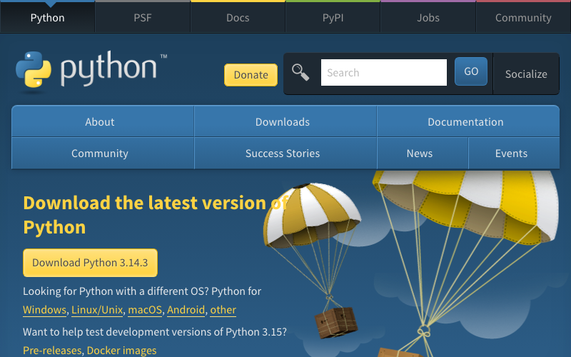
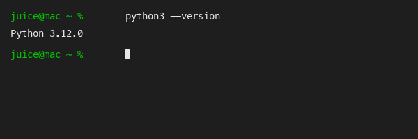
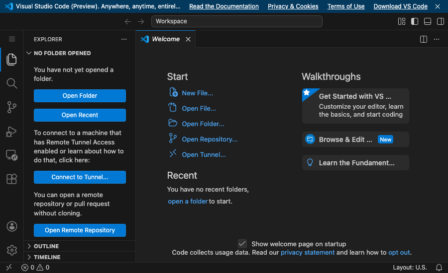
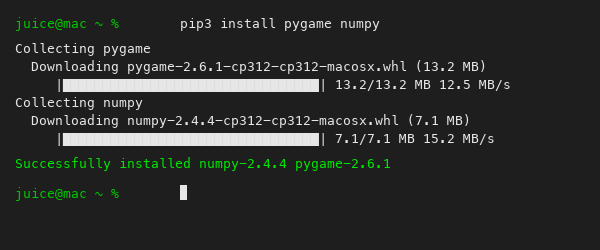
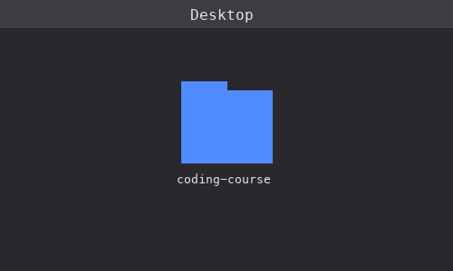

# Robert's Coding Course

!!! success "🎯 Mission"
    Learn Python. Build games. Go from zero to building your own dungeon crawler.

---

## Hey Robert!

Welcome to your coding course. By the end of this, you're going to build a dungeon crawler game -- like Minecraft Dungeons, but one you made yourself. Pretty cool, right?

But we're not starting there. We're starting small, building up, and every single lesson ends with something you can actually play. Here's the plan:

### The Journey

| Project | What You're Building |
|---------|----------------------|
| **Getting Started** | Your first programs — printing, variables, loops, lists, and a guessing game |
| **Connect 4** | A full Connect 4 game — terminal, then graphics, then animation |
| **Snake** | The classic Snake game, then rebuilt with classes |
| **Dungeon Crawler** | A Minecraft Dungeons-style game with enemies, combat, loot, bosses, and co-op |

### How This Course Works

- **You build real games, not boring examples.** Every lesson makes something you can actually play.
- **It's okay to be messy at first.** You'll write code that works, then later learn cleaner ways to do it. That's how real programmers learn too.
- **Nothing is hidden.** You'll see how everything works under the hood.

---

## Setting Up Your Computer

Before you can write code, we need to install a couple of things. This only takes about 10 minutes, and you only have to do it once.

### Step 1: Install Python



Python is the programming language you're going to learn. There are lots of programming languages out there — JavaScript, C++, Java, Rust — but Python is the best one to start with. Why?

- **It reads like English.** `if health < 0: game_over()` — you can almost guess what that does without knowing any code.
- **It runs your instructions top to bottom.** No weird magic happening behind the scenes. You see exactly what your program does.
- **It's used everywhere.** Instagram, YouTube, and Spotify all use Python. So do scientists, game developers, and AI researchers.
- **It has Pygame** — a library that makes it easy to build real games with graphics, which is exactly what we're going to do.

Here's how to install it:

1. Open your web browser (Safari, Chrome, whatever you use)
2. Go to [python.org/downloads](https://www.python.org/downloads/)
3. You'll see a big yellow button that says something like **"Download Python 3.x.x"** -- click it
4. A `.pkg` file will download. Find it in your Downloads folder and double-click it
5. An installer window will pop up. Just click **Continue** through each step, then click **Install**
6. It might ask for your password -- that's your Mac's password (ask your dad if you need help)
7. When it says "The installation was successful," click **Close**

Nice! Python is installed.

### Step 2: Make Sure Python Works



Let's check that it actually installed. We're going to open something called the **Terminal**. 

The Terminal is how programmers talk directly to the computer. Instead of clicking buttons and icons, you type commands. It might look scary at first — just a black screen with a blinking cursor — but it's actually super powerful. Think of it like a text message conversation with your computer: you type a command, hit Enter, and your computer responds.

1. Press **Cmd + Space** on your keyboard (that opens Spotlight search)
2. Type **Terminal**
3. Hit **Enter**

A window will pop up with a blinking cursor. This is the Terminal. Type this and hit Enter:

```bash
python3 --version
```

You should see something like `Python 3.12.0` (the exact number doesn't matter, as long as it starts with 3). If you see that, Python is working!

If you get an error, ask your dad to help troubleshoot -- sometimes Macs need an extra step.

### Step 3: Install VS Code



*This is what VS Code looks like when you first open it.*

You could write Python code in any text editor — even Notepad. But **VS Code** (Visual Studio Code) is what most real programmers use. It's free, made by Microsoft, and it gives you superpowers:

- **Syntax highlighting** — your code gets colored so it's easier to read. Keywords in one color, text in another, numbers in another.
- **Error detection** — it underlines mistakes before you even run your code, like spell-check for programming.
- **Built-in Terminal** — you can write code AND run it in the same window, side by side.
- **Extensions** — you can add extra features, like Python support.

1. Go to [code.visualstudio.com](https://code.visualstudio.com)
2. Click the big blue **"Download for Mac"** button
3. A `.zip` file will download. Find it in your Downloads folder and double-click it to unzip
4. You'll see an app called **Visual Studio Code** -- drag it into your **Applications** folder
5. Open it from Applications (or press Cmd + Space, type "Visual Studio Code", hit Enter)

When VS Code opens for the first time, it might show you some welcome tabs. You can close those.

Now let's add one helpful thing to VS Code:

1. Look at the left sidebar -- there's an icon that looks like four squares (one is floating away). Click it. That's the **Extensions** panel.
2. In the search box at the top, type **Python**
3. The first result should be "Python" by Microsoft. Click the blue **Install** button.

That's it! VS Code is ready.

### Step 4: Install Pygame and NumPy



Python by itself can do math, print text, and work with files — but it doesn't know how to open a game window or draw graphics. That's where **libraries** come in. A library is code that someone else wrote that you can use in your own programs. Instead of building everything from scratch, you stand on their shoulders.

We need two libraries:

- **Pygame** — this is what turns Python into a game engine. It can open windows, draw shapes, play sounds, and handle keyboard and mouse input. Every game we build in this course (Connect 4, Snake, the dungeon crawler) uses Pygame.
- **NumPy** — this is a math library that makes it easy to work with grids of numbers. We'll use it for the Connect 4 board.

Open Terminal again (Cmd + Space, type Terminal, hit Enter) and type this command, then hit Enter:

```bash
pip3 install pygame numpy
```

You'll see a bunch of text scroll by — that's normal. It's downloading and installing them. Think of `pip3` like an app store for Python — it lets you install extra tools that other people have made.

If you see any red error text, ask your dad to help with this.

### Step 5: Create Your Coding Folder



Programmers keep their projects organized in folders — one folder per project. Your Desktop is a good place to put it because it's easy to find. In Terminal, type this and hit Enter:

```bash
mkdir ~/Desktop/coding-course
```

That just created a folder called `coding-course` on your Desktop. You should be able to see it there! Every file you make during this course will go in that folder. By the end, it'll be full of games you built.

---

## How to Use This Course

Here's the deal:

1. **Read each lesson** on this site, step by step
2. **Type the code yourself** -- seriously, don't copy and paste! I know it's tempting, but typing it yourself helps your brain learn it way faster. It's like how you remember a phone number better if you dial it yourself instead of tapping a contact.
3. **Run your code** after every step to see what happens. Don't wait until the end!
4. **Try the experiments** -- change things, break things on purpose, see what happens. You won't hurt anything, I promise.
5. **Try the challenge** at the end before moving on

Go at your own speed. Some lessons might take 20 minutes, some might take a couple of days. There's no timer, no grade, no rush. If you get stuck, take a break and come back to it. Sometimes your brain needs time to chew on things.

---

## Ready?

Let's go write your first line of code.

[Start Lesson 1 -- Hello World](lessons/01-hello-world/lesson.md)
